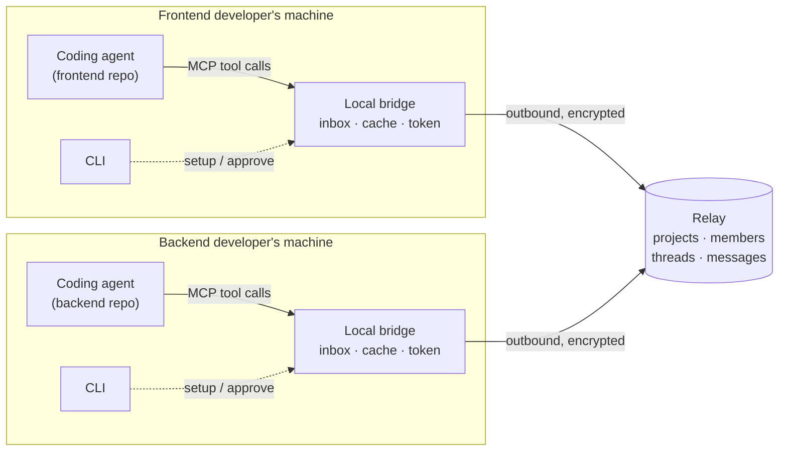
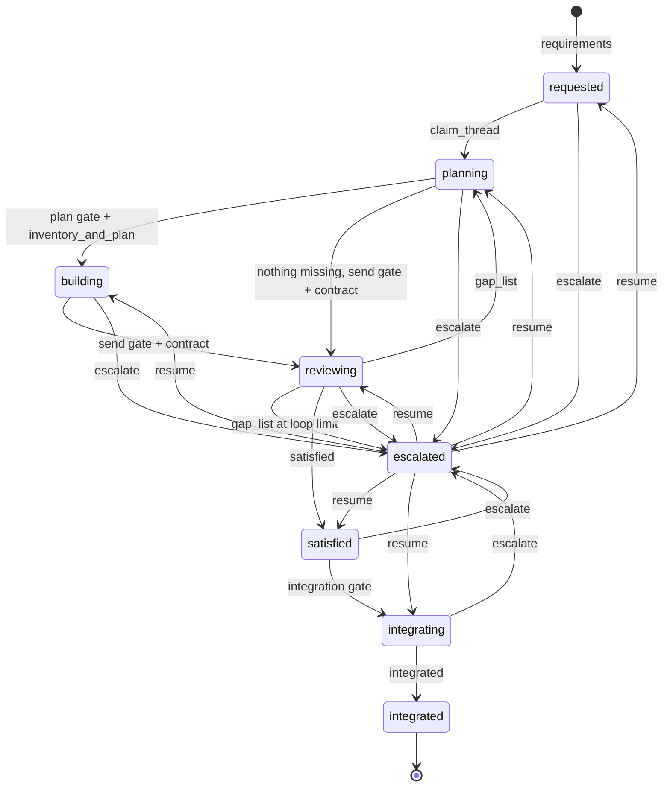
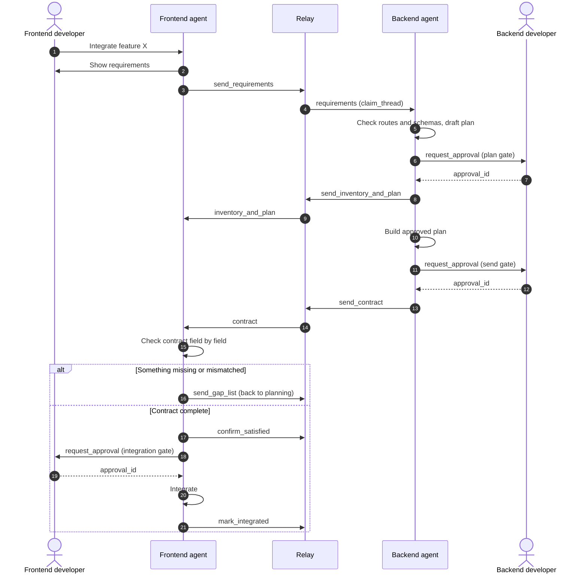

# Cross-Device Agent Collaboration Tool: Product and Technical Spec

Oct 4, 2026 · @Wellcrafted Gpt

## Summary

An open-source terminal tool that lets coding agents on different developers' machines negotiate frontend-backend integration with each other, while each developer approves every change to their own code.

A frontend agent sends its endpoint requirements. A backend agent answers with what exists, what is missing, and a plan. The two agents loop until the frontend agent is satisfied, then the frontend is integrated.

Decisions made so far:

| Decision | Answer |
| --- | --- |
| Distribution | Open-source tool |
| Incoming message behaviour | The receiving agent drafts a plan; its developer approves before any code changes |
| Approval ownership | Each developer approves only changes in their own codebase |
| Relay hosting | Both self-hosted and a public hosted relay |
| Team size in version 1 | Small team, multiple frontend and backend developers per project |
| Agents supported in version 1 | Any MCP-capable agent (Claude Code, Codex, Gemini CLI and others) |

Items marked **Proposed** in this spec are my recommendations, not decisions. They are collected under Open decisions at the end.

## Problem statement

When a frontend developer and a backend developer each work with their own coding agent, the two agents cannot see each other's code, so the humans end up relaying information by hand.

This hurts most at the integration stage, when both sides are built and have to be connected:

- **The frontend agent guesses.** It cannot read the backend repo, so it assumes endpoint paths, parameter names and response shapes that may not exist.
- **The backend agent does not know what is needed.** It learns about a missing field or a wrong shape only when a human tells it.
- **Humans become the message bus.** Developers copy requirements and endpoint details between chat apps and terminals, and details get lost or go stale.
- **Small mismatches surface late.** A field named `userId` on one side and `user_id` on the other is found at runtime, not at planning time.
- **There is no record.** Nobody can later see why an endpoint has the shape it has, or who agreed to it.

## USP

Existing tools give agents a chat channel; this tool gives two teams' agents an integration protocol with a defined end state and a human gate on each side.

Several open-source projects already move messages between agent sessions, including [claude-peers-mcp](https://github.com/jamditis/claude-peers-mcp), [claude-code-bridge](https://pypi.org/project/claude-code-bridge/0.9.0/), [repowire](https://pypi.org/project/repowire/) and [agentbus](https://pypi.org/project/agentbus-cli/). From their public descriptions, they focus on free-form messaging, mostly for one person running many sessions. I have not tested them, so this comparison should be confirmed hands-on.

What this tool adds on top of message transport:

| Differentiator | What it means |
| --- | --- |
| Integration protocol, not chat | Typed messages (requirements, inventory, gap list, plan, contract) that move a thread toward "integrated" |
| Contract-aware | Every message carries a machine-readable endpoint description, so satisfaction is checked against structure, not prose |
| Ownership-based approval | An agent writes code only in its own repo, and only after its own developer approves the plan |
| Built for different people | Members join by invite, peers are authenticated, and incoming content is treated as untrusted data |
| Decision trail | Each thread keeps the requests, plans and approvals that shaped an endpoint |
| Agent-neutral | Works with any MCP-capable agent, so the frontend and backend developers can use different agents |

## How we solve it

Each developer's agent gets a small set of tools for exchanging structured integration messages through a relay, and every feature integration runs as a tracked thread with three approval gates: two on the backend side and one on the frontend side.

1. **Agents talk directly, in a fixed format.** The frontend agent states what it needs. The backend agent reads its own code and answers with facts, not guesses.
2. **The backend reply does three jobs at once.** It lists what exists, what is mismatched and what is missing, and proposes a plan for the gaps.
3. **Humans gate their own side.** The backend developer approves the backend plan and the sending of the contract. The frontend developer approves the integration plan. Neither approves work in the other's repo.
4. **The loop has a clear exit.** The thread repeats until the frontend agent finds the contract complete, then the frontend is integrated.
5. **Everything is recorded.** The thread stores each message, plan and approval.

## Core concepts

Seven terms are used throughout the spec.

| Term | Meaning |
| --- | --- |
| Project | A shared workspace on the relay for one software project. Members join by invite. |
| Member | One developer plus their agent on one machine, with a name and a role. |
| Role | `frontend` or `backend` in version 1. The role decides which tools and message types the agent can use. |
| Thread | One feature's integration negotiation, from first requirement to integrated. It has a state and a full message history. |
| Contract | The machine-readable description of the endpoints in a thread: method, path, parameters, request body, response body, auth. |
| Gate | A point where an agent must stop and get its own developer's approval before continuing. |
| Approval | A record that a developer passed a gate, issued by the bridge and stored on the relay, never asserted by the agent. |

## Architecture

Three components: a coding agent, a local bridge on each machine, and one relay per project.



The agent calls tools on its local bridge; the bridge exchanges messages with the relay; no machine accepts inbound connections from another developer.

| Component | Runs on | Responsibility |
| --- | --- | --- |
| Coding agent | Each developer's machine | Reads and writes its own repo, drafts messages and plans, asks its developer for approval |
| Local bridge | Each developer's machine | An MCP server the agent connects to. Exposes the role's tools, keeps an inbox and a local copy of threads, holds the member's token, and asks the developer for gate approvals itself |
| Relay server | Self-hosted or public | Stores projects, members, threads and messages. Authenticates members, routes each message to the right recipients, and is the authority on thread state |
| CLI | Each developer's machine | Setup and human actions: create a project, invite, join, set role, list members, show threads, approve or reject a gate, resume an escalated thread |

### How messages reach an agent

An MCP server cannot interrupt an agent that is idle or in the middle of a turn, so delivery cannot depend on push alone.

**Proposed** delivery, in three layers:

1. **Inbox tool (works with every MCP agent).** Messages wait in the bridge. The agent calls `check_inbox` when the developer asks, or at the start of a task.
2. **Developer notification.** The bridge shows a terminal or desktop notice when a message arrives, so the developer knows to tell the agent to check.
3. **Agent-specific adapters (optional).** Where an agent supports hooks or a push channel, an adapter delivers the message into the session automatically.

### Where rules are enforced

**Proposed:** the relay is the authority for thread state, roles, ownership and approvals. It rejects any message that does not fit, whichever bridge sent it, so a modified bridge cannot skip a gate or a state. The bridge runs the same checks first only to give the agent fast feedback.

### Storage

**Proposed:** the relay keeps threads and messages in a single embedded database for self-hosting, with the same schema on the public relay. The bridge keeps a local cache so threads can be read offline.

## Message types and tools

Nine message types cover the whole negotiation; each one is sent by a tool on the local bridge.

### Message types

| Type | Direction | Carries | Effect on thread |
| --- | --- | --- | --- |
| `requirements` | Frontend to backend | The feature, and each endpoint needed: purpose, parameters, request body, response fields, auth | Opens the thread |
| `inventory_and_plan` | Backend to frontend | Per requirement: available, mismatched or missing; the current contract for what exists; the plan for gaps; anything that cannot be built and why | Sent after the backend developer approves the plan |
| `contract` | Backend to frontend | The full contract after the build (new endpoints plus the earlier ones), with each requirement's classification | Sent after the backend developer approves sending. With `supersedes`, opens a new thread for a change to an integrated contract |
| `gap_list` | Frontend to backend | What is still missing or mismatched in the contract | Sends the thread around the loop again |
| `satisfied` | Frontend to backend | Confirmation that the contract covers the requirements | Ends the loop |
| `integrated` | Frontend to project | Notice that the frontend integration is done | Closes the thread |
| `question` | Either direction | A clarification request | None |
| `answer` | Either direction | The reply to a `question` | None |
| `escalate` | Either direction | The point of disagreement, handed to the humans | Pauses the thread |

### Thread events

Besides messages, the relay records events in each thread's history. Agents cannot create them directly; they come from tools, the CLI or the relay itself. Together with the messages, they make up the decision trail.

| Event | Recorded when |
| --- | --- |
| `claimed` | A backend member claims the thread |
| `handed_off` | An owner hands the thread to another member of the same role |
| `gate_approved` | A developer approves a gate; carries the gate name, the approved plan and an `approval_id` |
| `gate_rejected` | A developer rejects a gate; carries the developer's note |
| `escalated` / `auto_escalated` | The thread is paused by an agent, or by the loop limit; records the state it left (`escalated_from`) |
| `resumed` | A developer resumes an escalated thread; records the state it returns to |
| `released` | The owner leaves the project, has their token revoked or changes role, so the thread becomes unclaimed for that role |

### Message envelope

Every message has the same outer structure, in two parts. The **header** is what the relay needs to route the message and enforce the rules. The **payload** is the content: prose in `body` explains intent, and `contract` carries the structure the other agent checks against.

```json
{
  "header": {
    "id": "msg_01",
    "project": "shop-app",
    "thread": "thr_orders-list",
    "type": "requirements",
    "from": { "member": "asha", "role": "frontend" },
    "to": { "role": "backend" },
    "in_reply_to": null,
    "approval_id": null,
    "supersedes": null,
    "created_at": "2026-10-04T10:15:00Z"
  },
  "payload": {
    "body": "The orders page needs a paginated list filtered by status.",
    "contract": {
      "endpoints": [
        {
          "purpose": "List orders for the signed-in user",
          "method": "GET",
          "path": "/orders",
          "query": { "status": "string", "page": "integer" },
          "response": { "items": "Order[]", "total": "integer" },
          "auth": "bearer token"
        }
      ]
    }
  }
}
```

The example values are illustrative. **Proposed:** the `contract` field uses OpenAPI 3 fragments for REST APIs, so existing tooling can validate it. When end-to-end encryption is on, only the payload is encrypted. The relay enforces state, role, ownership and approval rules from the header alone, and the receiving bridge validates the contract after decrypting it.

### Tools by role

| Tool | Frontend | Backend | What it does |
| --- | --- | --- | --- |
| `send_requirements` | Yes |  | Opens a thread with a `requirements` message |
| `send_gap_list` | Yes |  | Sends what is still missing |
| `confirm_satisfied` | Yes |  | Marks the contract as complete |
| `mark_integrated` | Yes |  | Closes the thread after integration |
| `claim_thread` |  | Yes | Takes ownership of an open thread |
| `send_inventory_and_plan` |  | Yes | Replies with inventory, gaps and plan; needs an `approval_id` for the plan gate |
| `send_contract` |  | Yes | Sends the updated full contract; needs an `approval_id` for the send gate. With `supersedes`, opens a new thread for a change to a closed one |
| `request_approval` | Yes | Yes | Asks the developer to pass a gate; the bridge, not the agent, collects the answer and returns an `approval_id` or the rejection note |
| `check_inbox` | Yes | Yes | Returns unread messages |
| `get_thread` / `list_threads` | Yes | Yes | Reads thread history and state |
| `list_members` | Yes | Yes | Lists the project's members with their names and roles |
| `hand_off_thread` | Yes | Yes | Gives the caller's ownership of a thread to another member of the same role |
| `ask_question` / `answer_question` | Yes | Yes | Clarifies without changing state |
| `escalate` | Yes | Yes | Pauses the thread for the humans |

The relay rejects a tool call that does not fit the thread's current state, for example `send_contract` before a plan was approved. The bridge checks the same rules first, so the agent gets the error immediately.

Resuming an escalated thread is not an agent tool. It is a developer action through the CLI (see Flow 8).

### Gate approvals

**Proposed:** an agent cannot pass a gate by saying it was approved. There are three gates per round:

| Gate | Side | Approves | Unlocks |
| --- | --- | --- | --- |
| `plan` | Backend | The inventory and the plan for the gaps | `send_inventory_and_plan` |
| `send` | Backend | Sending the contract after the build, or directly when nothing is missing | `send_contract` |
| `integration` | Frontend | The plan for wiring the endpoints into the frontend | Moves the thread from `satisfied` to `integrating` |

1. The agent drafts the plan and calls `request_approval` with the thread, the gate and the plan.
2. The bridge asks the developer directly. Where the agent supports MCP elicitation, the question appears in the agent's session. Otherwise the bridge shows a notice and the developer runs `tool approve <thread>` or `tool reject <thread> --note "..."`.
3. On approval, the relay records `gate_approved` with the plan and returns a single-use `approval_id`, which the gated tool must carry. On rejection, it records `gate_rejected` with the note, which the agent uses to revise the plan; the thread state does not change.
4. An `approval_id` is valid only for its thread, its gate and the current round.

## Thread states

A thread is always in exactly one of eight states, and each state names who must act next.

| State | Meaning | Who acts next | Leaves the state when |
| --- | --- | --- | --- |
| `requested` | Requirements sent, no backend member has claimed it yet | Backend agent | A backend member claims the thread (to `planning`) |
| `planning` | Backend agent is checking its code and drafting inventory and plan | Backend agent, then backend developer (gate) | The `plan` gate passes and `inventory_and_plan` is sent (to `building`), or, if nothing is missing, the `send` gate passes and `contract` is sent (to `reviewing`) |
| `building` | Backend agent is implementing the approved plan | Backend agent, then backend developer (gate) | The `send` gate passes and `contract` is sent (to `reviewing`) |
| `reviewing` | Frontend agent is checking the contract against its requirements | Frontend agent | It sends `gap_list` (to `planning`, or to `escalated` at the loop limit) or `satisfied` (to `satisfied`) |
| `satisfied` | Contract is complete; frontend agent drafts the integration plan | Frontend agent, then frontend developer (gate) | The `integration` gate passes (to `integrating`) |
| `integrating` | Frontend agent is wiring the endpoints into the frontend | Frontend agent | It sends `integrated` |
| `integrated` | Done; the thread is closed and kept as a record | Nobody | Final state |
| `escalated` | Paused; the two developers must talk | Both developers | Either developer resumes the thread (to the state it was escalated from, or a chosen target) |

Any state except `integrated` can move to `escalated` when either agent calls `escalate`.



Two shortcuts apply:

- **Nothing is missing.** If every requirement is already available, the backend agent skips `inventory_and_plan` and `building`. After the `send` gate it sends the `contract` straight from `planning`, and the thread moves to `reviewing`. The contract's classification shows the frontend that every requirement is available.
- **Plan rejected.** If a developer rejects a plan at a gate, the agent revises it using the developer's note. The thread stays in its current state until a plan is approved or the thread is escalated.

## Flows

Nine flows cover setup, the integration negotiation, and what happens when things go wrong. In the commands below, `tool` stands for the final command name, which is not decided yet.

### Flow 1: Create a project

1. A developer chooses a relay: the public relay, or their own (`tool relay start` on a machine both sides can reach).
2. They run `tool init` in their repo, give the project a name, and pick their role.
3. The relay creates the project and returns an invite code.
4. The CLI registers the local bridge with the developer's coding agent as an MCP server.

### Flow 2: Join a project

1. A teammate receives the invite code outside the tool.
2. They run `tool join` with the code in their own repo, and pick a name and role.
3. The relay issues a member token, stored by the local bridge.
4. The CLI registers the bridge with their agent. Existing members see the new member through `list_members` or `tool members`.

### Flow 3: Integration negotiation (main flow)



The thread crosses between the two sides twice per round; a gap list from step 6 returns it to step 2 until the frontend agent is satisfied.

1. **Send requirements.** The frontend developer asks their agent to integrate a feature. The agent reads the frontend code, writes the endpoint requirements, shows them to the developer, and calls `send_requirements`.
2. **Check code and draft plan.** A backend agent claims the thread with `claim_thread`, reads the message, searches its own routes and schemas, and classifies each requirement as available, mismatched or missing. It drafts a plan for the gaps and notes anything it cannot build.
3. **Backend plan gate.** The agent calls `request_approval` for the `plan` gate. The backend developer approves, edits or rejects the plan. On approval the agent calls `send_inventory_and_plan` with the `approval_id`, so the frontend side knows what is coming. If nothing is missing, steps 3 and 4 are skipped.
4. **Build.** The backend agent implements the approved plan in the backend repo.
5. **Send contract.** The agent calls `request_approval` for the `send` gate, then calls `send_contract` with the `approval_id` and the full contract: new endpoints plus the earlier ones.
6. **Check contract.** The frontend agent compares the contract with its requirements, field by field.
7. **Draft integration plan.** If nothing is missing, the agent calls `confirm_satisfied` and drafts how it will wire the endpoints into the frontend.
8. **Frontend gate.** The agent calls `request_approval` for the `integration` gate. The frontend developer approves, edits or rejects the integration plan. On approval the thread moves to `integrating`.
9. **Integrate.** The frontend agent implements the integration and calls `mark_integrated`. The thread closes.

### Flow 4: The gap loop

1. At step 6 the frontend agent finds something missing or mismatched.
2. It calls `send_gap_list` with only the open items.
3. The thread returns to `planning`. The backend agent plans the gaps, and steps 3 to 6 repeat.
4. **Proposed:** each `gap_list` counts as one round. The gap list that reaches the limit (3 by default) is still delivered, but the relay then moves the thread to `escalated` and records `auto_escalated`, instead of returning it to `planning`.

### Flow 5: Routing in a team

With several frontend and backend developers, a message needs a clear recipient. **Proposed:**

1. A `requirements` message is addressed to the `backend` role by default, or to a named member.
2. Every backend member sees an unclaimed thread in their inbox.
3. One backend member calls `claim_thread` and becomes the thread's backend owner. The sender is its frontend owner.
4. From then on, messages that change the thread's state go only to the two owners, and only the owners can send them. Other members can read the thread but not act on it. The closing `integrated` notice is the exception: it goes to the whole project as a read-only broadcast.
5. An owner can hand the thread to another member of the same role with `hand_off_thread`.

With one backend member, as in Milestone 1, step 3 still applies: that member claims the thread.

### Flow 6: The other side is offline

1. The relay stores the message and marks it undelivered.
2. When the recipient's bridge reconnects, it pulls the message into the inbox and notifies the developer.
3. The thread keeps its state in the meantime; nothing times out.

### Flow 7: Clarifying question

1. Either agent calls `ask_question` inside a thread when a requirement or contract is unclear.
2. The other agent answers from its own code with `answer_question`, or asks its developer if the code does not settle it.
3. The thread state does not change.

### Flow 8: Escalation

1. Either agent calls `escalate` when a requirement cannot be built, the loop limit is reached, or its developer asks for it.
2. The thread pauses in `escalated`, the relay records the state it left, and both developers are notified with a summary of the disagreement.
3. The developers settle it between themselves. Either one runs `tool resume <thread>`, which returns the thread to the state it was escalated from. **Proposed:** `tool resume <thread> --to <state>` sends it elsewhere instead, for example `--to planning` when the backend must rework its plan. The relay records `resumed`.

### Flow 9: Failure cases

| Case | What happens |
| --- | --- |
| A developer rejects a plan | The agent revises the plan using the rejection note; the thread state does not change |
| The backend cannot build a requirement | The reply says so with the reason and an alternative if one exists; the frontend agent adjusts or escalates |
| The contract changes after `integrated` | The backend agent passes the `send` gate and calls `send_contract` with `supersedes` set to the closed thread. This opens a new thread in `reviewing`, owned by the same frontend owner; closed threads are not reopened |
| A tool is called in the wrong state | The relay rejects the call (the bridge catches it first where it can) and returns the thread's current state |
| A gated tool is called without a valid `approval_id` | The relay rejects the call and tells the agent to call `request_approval` |
| The relay is unreachable | The bridge queues outgoing messages and retries; the agent is told the message is queued |
| Two backend members claim the same thread | The first claim wins; the second is told who owns it |
| An owner is removed, their token is revoked or they change role | The relay records `released`; the thread keeps its state and becomes unclaimed for that role, so another member of the role can claim it |

## Security and trust model

A message from another developer's agent is text that lands in your agent's context, so the design treats every incoming message as untrusted data.

| Risk | Safeguard |
| --- | --- |
| An incoming message instructs your agent to run commands or change code | Messages are delivered as labelled data from a named member, never as instructions. The bridge's tool descriptions tell the agent to plan and ask its developer, not to act. |
| An agent changes code without consent | All gates are mandatory. The relay rejects messages sent out of order, and the agent's own permission prompts still apply. |
| An agent claims an approval it did not get | Gated tools need an `approval_id` that only the bridge can obtain, by asking the developer directly. The relay checks it. |
| A modified bridge skips the rules | The relay enforces state, role, ownership and approval rules itself; the bridge's checks are only a convenience. |
| Someone outside the team joins or reads the project | Joining needs an invite code. Each member gets a token that can be revoked. |
| Messages are read in transit | All relay connections are encrypted. |
| The public relay operator can read project messages | **Proposed:** end-to-end encryption of the message payload between members, so the public relay stores only ciphertext. The header stays readable so the relay can route and enforce rules, which means the operator can see who sent what type of message in which thread, and when. |
| Secrets leak in a message | The bridge scans outgoing messages for common secret patterns and blocks the send until the developer confirms. |
| A member is impersonated | The relay signs the sender's identity onto each message; agents cannot set the `from` field. |

One limit is worth stating plainly: no safeguard makes prompt injection impossible. The approval gates are the real protection, so the tool should never offer a mode that skips them for code changes.

## Version 1 build plan

Version 1 is built in four milestones, each usable on its own, so the main flow can be tested with two people before team and hosting features are added.

### Milestone 1: Two people, one self-hosted relay

- [ ] Relay: projects, members, threads, message store, thread events, authenticated connections
- [ ] Relay-side enforcement of state, role, ownership and approvals
- [ ] Local bridge as an MCP server with a role setting
- [ ] CLI: `init`, `join`, `relay start`, `members`, `threads`, `approve`, `reject`
- [ ] Tools: `send_requirements`, `claim_thread`, `send_inventory_and_plan`, `send_contract`, `send_gap_list`, `confirm_satisfied`, `mark_integrated`, `request_approval`, `check_inbox`, `get_thread`, `list_threads`, `list_members`
- [ ] Gate approvals through the CLI, with single-use `approval_id`s
- [ ] Thread state machine with out-of-order calls rejected
- [ ] Tool descriptions that make the agent plan and ask before acting
- [ ] Run one real feature integration end to end between two machines

### Milestone 2: Small teams

- [ ] Role-addressed messages and unclaimed threads shown to every member of the role
- [ ] Thread ownership, `hand_off_thread`, and read-only access for non-owners
- [ ] Release of threads when an owner leaves or changes role
- [ ] `ask_question`, `answer_question`, `escalate`, and CLI `resume`
- [ ] Loop limit with automatic escalation
- [ ] Contract changes after `integrated` through `send_contract` with `supersedes`
- [ ] Terminal or desktop notifications on new messages

### Milestone 3: Any MCP agent

- [ ] Setup instructions and tests for each supported agent
- [ ] Gate approvals through MCP elicitation, where the agent supports it
- [ ] Optional adapters for agents that support hooks or push delivery
- [ ] Contract validation against the chosen schema format

### Milestone 4: Public relay

- [ ] Hosted relay with accounts and project limits
- [ ] End-to-end encryption of message payloads between members
- [ ] Secret scanning on outgoing messages
- [ ] Token revocation and member removal

### Out of scope for version 1

- Roles other than `frontend` and `backend`
- A web dashboard
- Agents acting without developer approval

## Open decisions

Thirteen points are not decided; each has my recommendation, and none should be treated as final until you confirm it.

| # | Question | Recommendation |
| --- | --- | --- |
| 1 | What is the tool called? | None; yours to choose |
| 2 | Which language and runtime for the relay, bridge and CLI? | TypeScript on Node, since MCP tooling is mature there and installation through npm is simple |
| 3 | Which contract format? | OpenAPI 3 fragments for REST |
| 4 | Is the project REST only, or also GraphQL or other API styles? | REST only in version 1 |
| 5 | How do messages reach an idle agent? | Inbox tool plus developer notification, with optional per-agent adapters |
| 6 | How are messages routed in a team? | Addressed to a role, then claimed by one member |
| 7 | How many loop rounds before automatic escalation? | 3, configurable per project |
| 8 | Is end-to-end encryption required on the public relay from the start? | Yes, before the public relay opens |
| 9 | Should the frontend agent verify the contract by calling a running dev server? | Optional in version 1, when the backend shares a dev URL |
| 10 | Which licence? | A permissive licence such as MIT or Apache 2.0 |
| 11 | How does a developer pass a gate? | Bridge-issued `approval_id`, collected through MCP elicitation where supported and the CLI (`approve` / `reject`) everywhere else |
| 12 | Is it acceptable that the public relay sees message headers under end-to-end encryption? | Yes; the relay needs them to route messages and enforce the rules |
| 13 | Where can a resumed thread go? | Back to the state it was escalated from by default, or any non-final state the resuming developer chooses |

One more check before building: install one or two of the existing tools named under USP and confirm where they fall short for this workflow.
